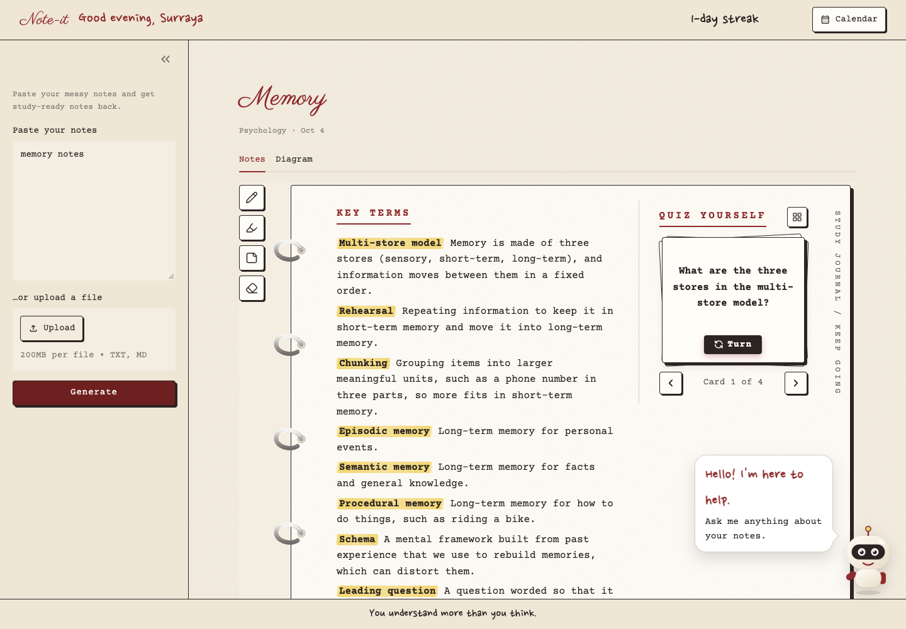

# NOTE-IT

Paste your rough lecture notes and get back notes you can study from, a diagram, and a study buddy that quizzes you. It all runs on your own laptop with Gemma and Ollama, so you can study offline, with no tabs or notifications pulling you away.

We made it for a friend who studies psychology, for the DEV Hacktoberfest Weekend Challenge ("Build for a Friend"), in the Best Use of Gemma category.



## What it does

NOTE-IT sorts your notes into key terms, theories and researchers, key studies, evaluation, real-world examples and a short quiz. It also draws a diagram of how the ideas connect.

The Study Buddy answers your questions from your own notes. It has three styles. Tutor explains things step by step. Peer talks like a friend who took the same course. Examiner asks you a question, marks your answer and tells you what you missed.

Every session is saved on your computer. A calendar shows the days you studied and your current streak.

Nothing is uploaded anywhere. After the one-time setup it needs no internet, and it costs nothing to run.

## Set up

You need [uv](https://docs.astral.sh/uv/) and [Ollama](https://ollama.com/download), both free. In a terminal:

```bash
git clone https://github.com/4leena/NOTE-IT.git
cd NOTE-IT
ollama pull gemma3:4b
uv sync
uv run streamlit run app.py
```

Open http://localhost:8501, paste your notes and click Generate. The first run downloads the model, which is a few GB. After that a set of notes takes about 20 to 30 seconds.

## Limits

It's built for psychology notes. Gemma 3 4B is a small model and sometimes drops details such as the exact numbers in a study, so check the results against your own notes. Notes longer than about 12,000 characters get cut off.

## Made with

Gemma 3 (4B), Google's open model, run through Ollama. Python and Streamlit for the app, uv for packages and [Mermaid](https://mermaid.js.org) (MIT License) for diagrams. The fonts are Courier Prime, Parisienne and Nanum Pen Script, all under the SIL Open Font License. The notebook tool icons are from [Lucide](https://lucide.dev) (ISC License). Robot mascot drawn for this project, inspired by stock robot illustrations.

We used Claude (Anthropic) through Claude Code to plan the work, write and test code, and draft test notes. We picked the idea, the design and the sections, and we ran and checked everything ourselves. Inside the app, Gemma on your machine does all the AI work.

## Team

Aleena ([@4leena](https://github.com/4leena)) designed the interface. Ahad Baig built the Gemma backend.

## License

MIT
